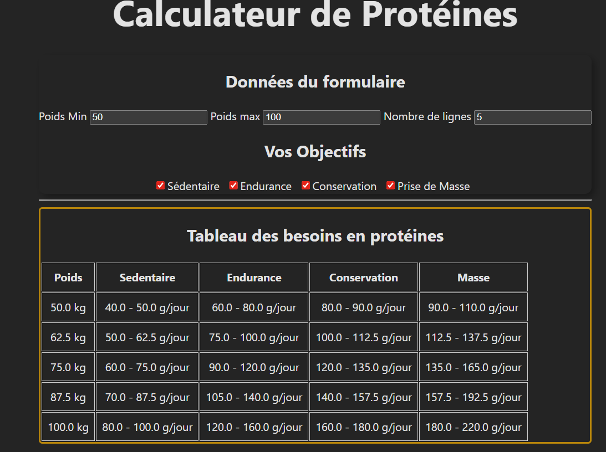

# Lancer le projet  
Se placer dans le bon dossier  
**cd mini-projet-test/mini-projet**    
Installer les packages nécessaires  
**npm install**  
Lancer l'application  
**npm run dev**  
Résultat attendu  
